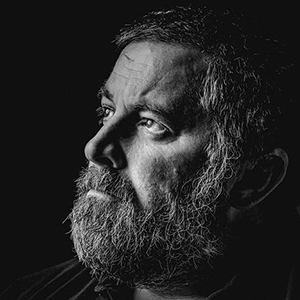

# CSS framework
---------------------------------------
사용한 프레임 워크
* bulma
* Bootstrap
* skeleton
---------------------------------------
* bulma

```html
<div class="p-3 mb-2 bg-primary text-white">

        <!-- 벌마 -->
        <section class="hero">
            <div class="hero-body">
                <div class="has-text-centered">
                   <p class="title">홍길동의 이력서</p> 
                </div>
            </div>
        </section>
```

* Bootstrap
```html

            <!-- 부트스트랩 테이블 사진위치,크기,색변경 -->
            <table class="table" style="margin-left: auto; margin-right: auto; ">
                <tbody>
                    <tr class="table-info">
                        <col width="1%">  
                        <th>이름</th>
                        <td>홍길동</td>
                    </tr>
                    <tr class="table-warning">
                        <th>직업</th>
                        <td>개발자</td>
                    </tr>
                    <tr class="table-success">
                        <th>나이</th>
                        <td>38</td>
                    </tr>
                    <tr class="table-dark">
                        <th>거주지</th>
                        <td>부산</td>
                    </tr>
                </tbody>
            </table>
```
* skeleton
```html
<h2 class="text-dark">Contact</h2>
            <!-- 스켈레톤 버튼 -->
            <ul>
                <li>
                    <a class="button button-primary" href="tel:0100000000">010-000-0000</a>
                </li>
                <li>
                    <a class="button button-primary" href="mailto:mail@mail.com" target="_blank">mail@mail.com</a>
                </li>
                <li>
                    <a class="button button-primary" href="https://facebook.com/myfacebook" target="_blank">@myfacebook</a>
                </li>
                <li>
                    <a class="button button-primary" href="https://naver.blog.com/myblog" target="_blank">@myblog</a>
                    </li>
            </ul>
```

># 사이트
netlify : 
<https://css-framework-gameprogramming.netlify.app>
github.io : 
